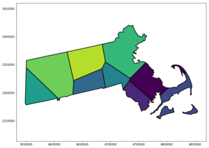

# Voronoi District #

Solve [gerrymandering](https://en.wikipedia.org/wiki/Gerrymandering) once and for all by redistricting the United States using [Voronoi tesselations](https://en.wikipedia.org/wiki/Voronoi_diagram), an unbiased way of dividing a space into random regions.

![By Elkanah Tisdale (1771-1835) (often falsely attributed to Gilbert Stuart)[1] (Originally published in the Boston Centinel, 1812.) [Public domain], via Wikimedia Commons](https://upload.wikimedia.org/wikipedia/commons/thumb/9/96/The_Gerry-Mander_Edit.png/229px-The_Gerry-Mander_Edit.png "By Elkanah Tisdale (1771-1835) (often falsely attributed to Gilbert Stuart)[1] (Originally published in the Boston Centinel, 1812.) [Public domain], via Wikimedia Commons")   VS.  

### Methodology ###

1. Lay random points over all states with more than one district according to population density.
2. Create Voronoi cells from the random points. These cells become Congressional districts.
3. Estimate the party balance in the House of Representatives using past voting data.
4. Calculate different tessllations and party membership for a large number of different random number seeds to find
probabilities of different levels of party membership.
5. Compare to current level of party membership.

### Current Status ###

This is a work in progress. Currently able to scatter random points on the U.S. map without using population density and figuring out how to divide a state into Voronoi cells.

#### Steps ####

- [x] Plot the United States.
- [x] Put random points in a state.
- [x] Put random points in all states.
- [x] Create Voronoi cells based on random points.
- [x] Find where Voronoi cells intersect state lines, creating districts.
- [ ] Divide all states into Voronoi cells.
- [ ] Color voronoi cells in visualization.
- [ ] Distribute random points based on population density.
- [ ] Find voting or party data by location.
- [ ] Color districts by likely party affiliation.
- [ ] Create redistricting results for many random number seeds.
- [ ] Plot probabilities of possible House of Representatives party splits.
- [ ] Find probability of current House split.

### Dependencies ###

1. Jupyter
2. Numpy
3. Scipy
4. Matplotlib
5. Basemap (To install with pip, you may need a direct link: https://github.com/matplotlib/basemap/issues/251)
6. Shapely (If installing with pip, this issue may apply: https://github.com/Toblerity/Shapely/issues/260)
